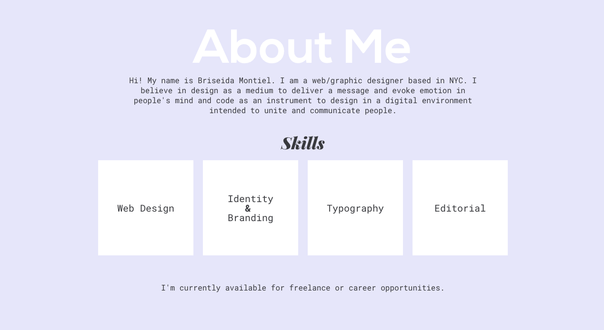

# About Me Page



### Technologies Used 

* Floats
* Clearfix
* Flexbox

### Sample Code 

```
    <div class"container">
        <div class="headline">
            <h1>About Me</h1>
            <p>Hi! My name is Briseida Montiel. I am a web/graphic designer based in NYC. I believe in design as a medium to deliver a message and evoke emotion in people's mind and code as an instrument to design in a digital environment intended to unite and communicate people.</p>
        </div>
        <div class="skills">
            <h2>Skills</h2>
        </div>
        <div class="clearfix">
            <div class="box"><p>Web Design</p></div>
            <div class="box"><p>Identity<br> <strong>&</strong> <br>Branding</p></div>
            <div class="box"><p>Typography</p></div>
            <div class="box"><p>Editorial</p></div>
        </div>
        <div class="bottomLine"><p>I'm currently available for freelance or career opportunities.</p></div>
    </div>

```

### Problems/Future Improvements

* Work on my navigation and portfolio page. 

### Author

:zap: Briseida Montiel


# project2
